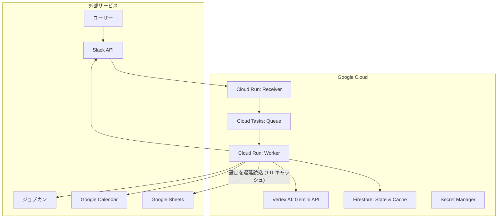

# kintai-sync

Slack メッセージをトリガーとした勤怠管理自動化システム。

## 概要

`kintai-sync` は、日々の煩雑な勤怠連絡とそれに付随する事務作業を自動化するためのシステムです。Slack の特定チャンネルに「明日、有給休暇を取得します」といったメッセージを投稿するだけで、システムが以下の処理をすべて自動で実行します。

1. **ジョブカン**: 休暇申請または勤務申請を自動提出
1. **Slack 報告**: 指定された事業部・部署チャンネルへフォーマットされた勤怠連絡を投稿
1. **Google カレンダー**: 自身のカレンダーに休暇や勤務予定を自動登録
1. **Slack ステータス**: プロフィールのステータスと絵文字を自動更新
1. **フィードバック**: 処理結果を元の Slack スレッドへ自動返信

## 主な機能

- **自然言語解析**: Vertex AI (Gemini 3 Flash Preview) を使用し、自由形式のテキストから日付や勤怠種別を正確に抽出。
- **堅牢なアーキテクチャ**: Google Cloud (Cloud Run, Cloud Tasks, Firestore) を採用し、高い信頼性、スケーラビリティ、およびべき等性を確保。
- **設定の一元管理**: `config.yaml` により、システム全体の動作をコード変更なしで調整可能。
- **ユーザー別カスタマイズ**: 各ユーザーのスタッフコードや勤務時間は Google スプレッドシートで管理。Worker が処理時に必要に応じてスプレッドシートを読み込み、Firestore にキャッシュ（遅延読み込み）するため、定期同期やスケジューラは不要。
- **モダンな開発環境**: `uv` による高速なパッケージ管理と、`Makefile` による一貫した運用コマンドを提供。

## システム構成図



## はじめに

### 前提条件

- [uv](https://github.com/astral-sh/uv) がインストールされていること。
- Google Cloud SDK (`gcloud`) が認証済みであること。
- Terraform がインストールされていること。

### 初期構築 (ブートストラップ)

以下のコマンドを実行して、Terraform のバックエンドバケットの作成と IAM 権限の設定を行います。

```bash
make setup
```

### 設定

1. `config.yaml` を環境に合わせて調整します。
1. Secret Manager に必要なトークンを登録します（例: `kintai-sync-slack-bot-token`）。
1. ユーザー設定用の Google スプレッドシートを準備します（フォーマットは `make template` で生成可能）。
1. スプレッドシート読み取り用の OAuth トークンを登録します（`make register-sheets-oauth`）。スプレッドシートはサービスアカウントへ共有できない（Workspace の組織外共有ポリシーで `gserviceaccount.com` が外部扱いになる）ため、シートを閲覧できるユーザーアカウントの OAuth リフレッシュトークンを Secret Manager に保存し、Worker はそのトークンで読み取ります。

### デプロイ

```bash
make deploy
```

## 開発・運用

### 環境構築

```bash
# 依存関係の同期とブラウザのインストール
uv sync
uv run playwright install chromium
```

### 便利なコマンド

- **`make test`**: すべてのユニットテストを実行（カバレッジ計測付き）。
- **`make lint`**: コードの静的解析とフォーマットを実行。
- **`make logs`**: Cloud Run の最新実行ログを確認。
- **`make register-user`**: ユーザーのパスワードを Secret Manager へ安全に登録。
- **`make register-sheets-oauth`**: 設定スプレッドシート読み取り用の OAuth トークンを取得・登録（初回のみ）。
- **`make destroy`**: Terraform 管理下のリソースを削除（初期構築リソースは維持）。

______________________________________________________________________

*最終更新日: 2026年6月27日*
