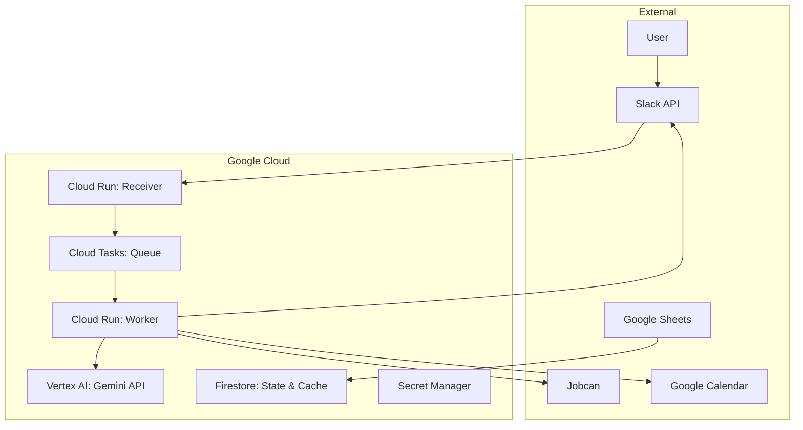

# kintai-sync

Automated attendance management system triggered by Slack messages.

## Overview

`kintai-sync` is a system designed to automate repetitive attendance-related tasks. By posting a single message to a Slack channel (e.g., "Taking a paid leave tomorrow"), the system automatically:

1.  **Jobcan**: Submits a holiday or attendance application.
2.  **Slack**: Posts a formatted report to the department channel.
3.  **Google Calendar**: Registers the leave/attendance event on your calendar.
4.  **Slack Status**: Updates your status and emoji automatically.
5.  **Feedback**: Replies to your original Slack thread with the execution results.

## Key Features

- **Natural Language Processing**: Uses Vertex AI (Gemini 1.5 Flash) to parse dates and attendance types from free-text messages.
- **Robust Architecture**: Built on Google Cloud (Cloud Run, Cloud Tasks, Firestore) for high reliability, scalability, and idempotency.
- **Centralized Configuration**: All system settings are managed via `config.yaml`.
- **User Personalization**: User-specific settings (working hours, staff codes) are managed in a Google Spreadsheet and synced to Firestore.

## System Architecture



## Getting Started

### Prerequisites

- Google Cloud Project with Billing enabled.
- Slack App with appropriate scopes (`chat:write`, `users.profile:write`, `events:read`).
- Jobcan account.
- Google Workspace account for Calendar/Sheets.

### Configuration

1.  Copy `config.yaml` and adjust settings for your environment.
2.  Set up environment variables for Cloud Run services (see `terraform/deploy.tf`).
3.  Register secrets in Secret Manager.

## Development

### Setup

```bash
pip install -r requirements.txt
playwright install chromium
```

### Testing

```bash
pytest
```

---
*Last updated: June 27, 2026*
