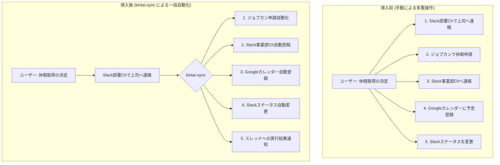
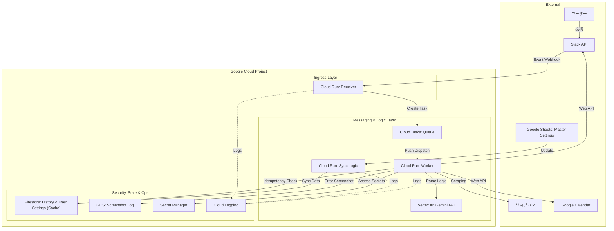
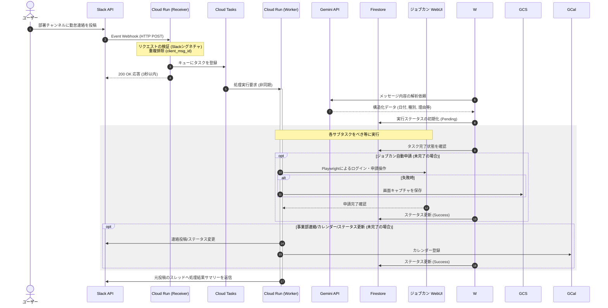

# 勤怠一括管理システム `kintai-sync` 要件定義書

## 1. ドキュメント制御

### 1.1. 改訂履歴

| バージョン | 発行日 | 改訂者 | 改訂内容 |
| --- | --- | --- | --- |
| v1.0.0 | 2026年6月27日 | 開発プロジェクトチーム | 初版作成（Slackトリガー・Google Cloud構成対応） |
| v2.0.0 | 2026年6月27日 | 開発プロジェクトチーム | アーキテクチャ刷新（Gemini API, Cloud Tasks, Firestore 採用による堅牢化とフィードバック機能の追加） |
| v2.1.0 | 2026年6月27日 | 開発プロジェクトチーム | マルチユーザー対応およびユーザー別設定機能（午前休・午後休の時間定義等）の追加 |
| v2.2.0 | 2026年6月27日 | 開発プロジェクトチーム | Googleスプレッドシートによる設定管理およびFirestoreへの同期機能、Terraform標準の追加 |
| v2.3.0 | 2026年6月27日 | 開発プロジェクトチーム | パッケージ管理の uv 移行、config.yaml による設定の集中管理、および Makefile によるライフサイクル自動化の追加 |

______________________________________________________________________

## 2. はじめに

### 2.1. 背景

現在、社内における出退勤および休暇時の連絡業務は、複数の異なるアプリケーション（ジョブカン、Slack、Googleカレンダー）に対して手動で個別に実施されている。特に休暇取得時やフレックス勤務の利用時には、上司への報告、部門全体への周知、自身のカレンダー予定の確保、Slackのステータス変更など、経由するシステムと操作ステップが多岐にわたり、従業員にとって多大な業務負荷および転記ミス・連絡漏れのリスクとなっている。

この課題を解決するため、従業員が日常的に利用するSlackへの1通の投稿をトリガーとし、関連するすべての勤怠処理を一括で自動実行するシステム `kintai-sync` を構築する。

また、本システムを複数のユーザーが利用する場合、ユーザーごとに「午前休」や「午後休」の勤務時間定義が異なる場合があり、個別のカスタマイズが必要となる。これらの設定は、管理者やユーザーが容易に編集・閲覧できるよう、**Googleスプレッドシート**をマスターデータとして管理し、システムのパフォーマンス維持のために**Firestore**へ自動同期する。

また、システム全体の動作設定（APIエンドポイント、プロンプトテンプレート等）は **config.yaml** で一元管理し、ソースコードからのハードコーディングを排除する。

### 2.2. 目的

1. **従業員の利便性向上**: 体調不良時や外出先からでも、Slackで上司へ連絡するだけで、すべての勤怠手続きを完結させる。
1. **周知漏れの防止**: カレンダー登録や部門チャンネルへの共有を自動化し、チーム内での勤怠情報の可視化を確実にする。
1. **運用の効率化**: サーバーレスアーキテクチャ、モダンなパッケージ管理ツール (**uv**)、およびインフラのコード化により、保守運用コストを最小化する。

### 2.3. システム化の範囲

本システムは、Slackの特定チャンネル（部署チャンネル）におけるユーザーの投稿を検知し、そのメッセージ内容を解析して、以下の5つの外部システム・コンポーネントへ情報を同期・操作する範囲を対象とする。

1. **ジョブカン（従業員マイページ）**: 休暇申請の自動実行
1. **Slack（事業部勤怠連絡チャンネル）**: フォーマット化された勤怠情報の自動投稿
1. **Googleカレンダー（ユーザー自身のカレンダー）**: 勤務時間枠への予定自動登録
1. **Slack（ユーザー自身のプロフィール）**: ステータス・絵文字の自動変更
1. **Slack（フィードバック通知）**: 元の投稿スレッドへの処理結果の自動返信（v2.0.0追加）

______________________________________________________________________

## 3. 全体概要

### 3.1. システム名

- **正式名称**: kintai-sync (キンタイ・シンク)
- **GitHubリポジトリ名**: `kintai-sync`

### 3.2. 業務フロー

本システム導入前後の業務フローを以下に示す。

### 3.3. システムアーキテクチャ図

本システムのGoogle Cloud上での物理構成を以下に示す。

### 3.4. システムシーケンス

外部接続APIの制限をクリアし、かつ高い信頼性を確保するための非同期分散処理シーケンスである。

______________________________________________________________________

## 4. 機能要件

### 4.1. Slack入力イベント検知・メッセージ解析機能

ユーザーが部署チャンネルに投稿した任意のテキストメッセージを検知し、システムが処理可能な構造化データに変換する。

- **【FR-1.1】トリガー対象の制限**

- システムは、あらかじめ指定された「部署チャンネル」の新規投稿のみを監視する。

- Botによる投稿、メッセージの編集イベント、およびスレッド内の返信は原則として処理対象外とする。

- **【FR-1.2】対象日付の動的解析ロジック（LLM優先）**

- **Vertex AI Gemini API** を利用し、自然言語メッセージから以下の項目を抽出する。

1. **date**: 対象日（ISO 8601形式）。「明日」「来週月曜」などの相対表記も絶対日付に変換する。
1. **type**: 勤怠種別（全休、午前休、午後休、遅刻、早退、フレックス等）。
1. **reason**: 理由（体調不良、私用など）。

- （フォールバックとして、従来の正規表現による解析ロジックも構成可能な状態で維持する）

- **【FR-1.3】勤怠種別の解析ロジック（疎結合設計）**

- LLMの抽出結果を、外部設定ファイル（`config.yaml`）で定義された内部IDにマッピングする。

- **【FR-1.4】メッセージの重複排除**

- Cloud Tasks と連携し、Slackから再送された同一の `client_msg_id` を持つリクエストを適切に排除する。

### 4.2. ジョブカン休暇申請自動化機能

解析された情報に基づき、ジョブカン従業員マイページに対する申請業務をブラウザ自動操作によって代行する。

- **【FR-2.1】セキュアログイン**

- ユーザーごとのジョブカンログイン情報（会社ID、スタッフコード、パスワード）を、Google Cloud Secret Managerから安全に取得し、ログイン処理を実行する。

- **【FR-2.2】申請画面の自動遷移および入力**

- 休暇申請ページ（`https://ssl.jobcan.jp/employee/holiday/new`）に遷移し、LLMが抽出した内容に基づき項目を自動入力する。

- **【FR-2.3】申請の確定（または確認）**

- 運用ルールに基づき、最終確定または確認状態での保存を選択可能とする。

- **【FR-2.4】べき等性の確保（v2.0.0）**

- 処理開始前に **Firestore** の状態を確認し、既に申請が成功している場合はジョブカン操作をスキップする。

- **【FR-2.5】視覚的デバッグ機能（v2.0.0）**

- ブラウザ操作に失敗した場合、エラー発生時の画面スクリーンショットを自動撮影し、**Cloud Storage (GCS)** へ保存する。保存先URLはログに出力する。

### 4.3. 事業部チャンネル勤怠連絡投稿機能

- **【FR-3.1】対象チャンネルの動的指定**
- **【FR-3.2】投稿フォーマットの自動生成**
- 書式: `[対象月]/[対象日]（[曜日]）【[勤怠種別]】`

### 4.4. Googleカレンダー予定登録機能

- **【FR-4.1】通常の勤務時間枠への時間指定登録**
- **【FR-4.2】時間枠の動的制御（疎結合設計）**

### 4.5. Slackステータス・アイコン自動変更機能

- **【FR-5.1】ステータステキストおよび絵文字の変更**
- **【FR-5.2】有効期限の自動設定**

### 4.6. 実行結果フィードバック機能（v2.0.0）

- **【FR-6.1】スレッドへの返信**
- Workerの全処理完了後、元の投稿のスレッドに対して、各タスク（ジョブカン、カレンダー等）の成否をアイコン付きで返信する。
- 例：「✅ ジョブカン申請 / ✅ カレンダー登録 / ❌ ステータス変更失敗（手動でお願いします）」

### 4.7. マルチユーザー・パーソナライズ設定機能（v2.2.0更新）

- **【FR-7.1】マスターデータの外部化（Googleスプレッドシート）**

- システムの設定値（ユーザーID、勤務時間定義等）のマスターデータは、専用のGoogleスプレッドシートで管理する。

- **【FR-7.2】Firestoreへの自動同期ロジック**

- スプレッドシートの更新をトリガー、または定期実行によってFirestoreの `users` コレクションへ同期する。

- 実行時のパフォーマンス低下を防ぐため、Workerは原則としてFirestore側のデータ（キャッシュ）を参照する。

- **【FR-7.3】ユーザー別勤務時間定義**

- 以下の項目をスプレッドシート上でユーザーごとに設定可能とする。

1. **slack_user_id**: SlackのメンバーID（キー）
1. **morning_off_start / morning_off_end**: 午前休時の勤務時間（例：09:00〜13:00）
1. **afternoon_off_start / afternoon_off_end**: 午後休時の勤務時間（例：14:00〜18:00）
1. **working_hours_start / working_hours_end**: 通常の勤務時間（例：09:00〜18:00）
1. **timezone**: ユーザーのタイムゾーン（デフォルト：Asia/Tokyo）

- **【FR-7.4】設定の自動適用**
- メッセージ解析後、投稿したユーザーの設定を Firestore から取得し、Googleカレンダーへの登録時間等に反映する。設定が存在しない場合は、システムデフォルト値を使用する。

### 4.8. 設定の一元管理機能 (v2.3.0)

- **【FR-8.1】外部設定ファイル (config.yaml) の採用**
  - システムの振る舞いを制御する静的なパラメータ（GCPリージョン、キューID、Geminiモデル名、各種メッセージフォーマット等）を `config.yaml` に集約する。
- **【FR-8.2】ハードコーディングの禁止**
  - ソースコード内に環境固有の文字列を直接記述せず、必ず `config.py` 経由で取得する設計を徹底する。

______________________________________________________________________

## 5. 非機能要件

### 5.1. 可用性・信頼性

- **【NFR-1.1】サーバーレスによる可用性の確保**
- **【NFR-1.2】レート制限とリトライ制御 (v2.0.0 強化)**
- **Cloud Tasks** を採用し、ジョブカンへの同時アクセス数を制限（例：5タスク/分）しつつ、エラー時の指数バックオフリトライを自動実行する。
- **【NFR-1.3】べき等性の担保**
- **Firestore** を利用してタスクの進捗状況を永続化し、リトライ時に同じ操作を二重に行わないように制御する。

### 5.2. 性能・拡張性

- **【NFR-2.1】Slack 3秒ルールの回避（非同期処理）**
- Receiverがリクエストを受け付けた直後にCloud Tasksへエンキューし、即座に200 OKを返す構成を維持する。

### 5.3. セキュリティ

- **【NFR-3.1】認証情報のセキュア管理** (Secret Manager)
- **【NFR-3.2】最小権限の原則** (IAM)

### 5.4. 運用・保守性

- **【NFR-4.1】インフラのコード化 (Terraform)**

- すべてのリソースは Terraform で管理し、`terraform destroy` によって全リソースが完全に削除可能となるよう設計する。

- **命名規則**: 識別性を高めるため、すべての主要リソースに `kintai-sync-` プレフィックスを付与する。

  - サービスアカウント例: `kintai-sync-worker-sa`
  - バックエンドバケット例: `kintai-sync-tfstate-[PROJECT_ID]`

- **削除ポリシー**:

  - GCSバケットには `force_destroy = true` を設定し、コンテンツが存在しても削除可能とする。
  - 削除時に残存しやすいリソース（Secret Managerの削除猶予等）は、Terraform側で即時削除されるよう設定を明示する。

- **【NFR-4.2】初期構築・運用コマンドの自動化 (Makefile)**
  - `make` コマンドによって、環境構築 (`setup`)、デプロイ (`deploy`)、テスト (`test`)、ログ確認 (`logs`)、破棄 (`destroy`) までのライフサイクルをワンストップで実行可能とする。
  - 複雑な `gcloud` コマンドや `terraform` コマンドのフラグ管理を Makefile 内に隠蔽する。

- **【NFR-4.3】一元的なログ管理**

- **【NFR-4.4】視覚的なエラー追跡 (v2.0.0)**

- スクレイピング失敗時の画像をGCSに保存することで、UI変更等の原因特定を迅速化する。

- **【NFR-4.5】モダンな依存関係管理 (uv)** (v2.3.0)
  - `uv` を採用し、高速なパッケージインストールと `uv.lock` による厳密なバージョン固定を実現する。
  - `pyproject.toml` による標準的なプロジェクト管理を行う。

### 5.5. 開発・実行環境

- **【NFR-5.1】ランタイム仕様** (Python 3.12+)
- **【NFR-5.2】環境のコンテナ化** (Docker/Cloud Run)
- **【NFR-5.3】パッケージマネージャー** (uv)

______________________________________________________________________

## 6. 外部インターフェース仕様

### 6.1. Slack API 連携

- **Event API / Web API (chat.postMessage / users.profile.set)** に加え、スレッド返信用の `thread_ts` 指定を利用する。

### 6.2. Google Calendar API 連携

### 6.3. Google Sheets API 連携

### 6.4. ジョブカン Web インターフェース

### 6.5. Vertex AI (Gemini) API

- メッセージ解析用の自然言語インターフェース。

______________________________________________________________________

## 7. 疎結合のためのデータ構造（設計要件）

（既存の構成を維持しつつ、LLM用のプロンプトテンプレート等も外部化対象とする）

______________________________________________________________________

## 8. 運用インフラコスト見積もり（概算）

（追加コンポーネントを含めた試算。無料枠を考慮しても月額数百円程度）

| サービス | 想定利用量 | 月額コスト (USD) | 備考 |
| --- | --- | --- | --- |
| **Cloud Run** | 1.2万リクエスト/月 | $0.00 | 無料枠内 |
| **Cloud Tasks** | 1.2万タスク/月 | $0.00 | 無料枠内 |
| **Firestore** | 10万Read/Write程度 | $0.00 | 無料枠内 |
| **Vertex AI** | Gemini 1.5 Flash (1.2万回) | ~$0.50 | 非常に低価格 |
| **Secret Manager** | 10個のシークレット | ~$0.30 | |
| **GCS/Logging** | 5GB程度 | ~$0.50 | |
| **合計** | - | **約 $1.30 (約200円)** | 依然として極めて安価 |
