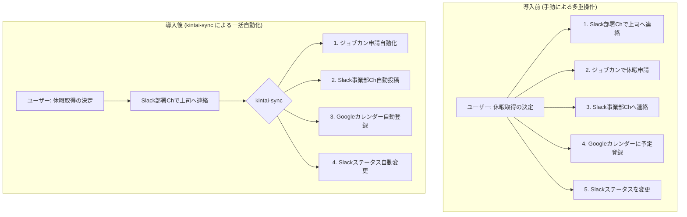
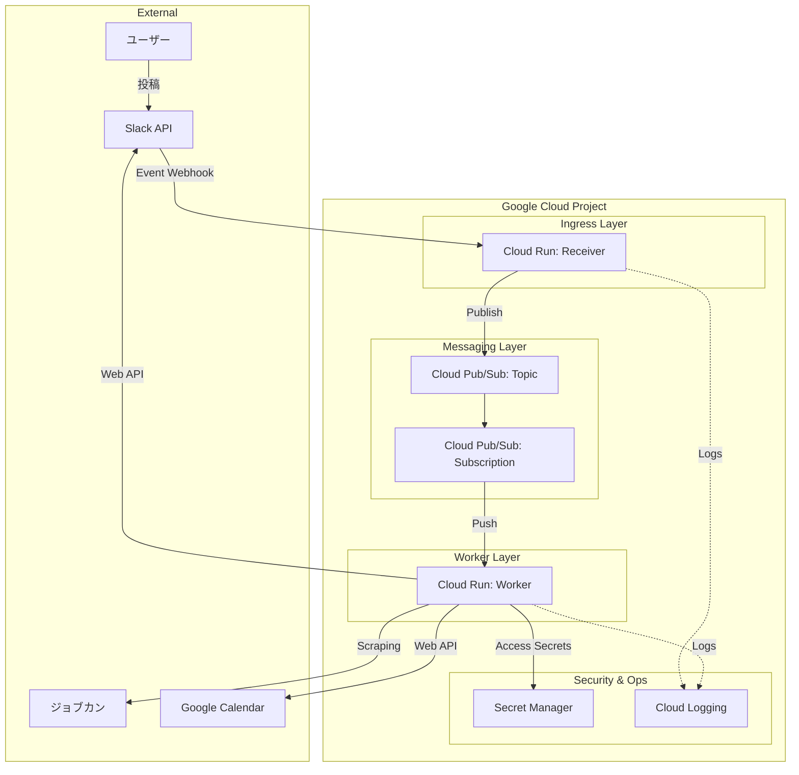
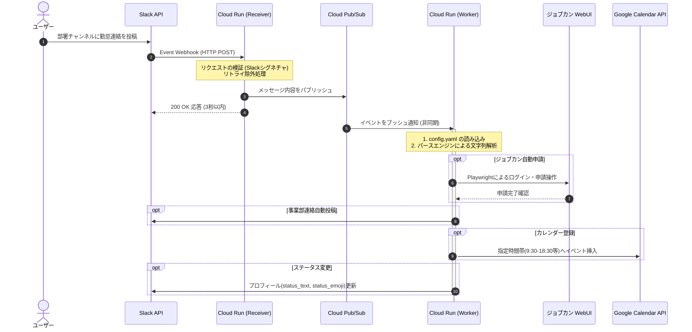

# 勤怠一括管理システム `kintai-sync` 要件定義書

## 1. ドキュメント制御

### 1.1. 改訂履歴

| バージョン | 発行日 | 改訂者 | 改訂内容 |
| --- | --- | --- | --- |
| v1.0.0 | 2026年6月27日 | 開発プロジェクトチーム | 初版作成（Slackトリガー・Google Cloud構成対応） |

---

## 2. はじめに

### 2.1. 背景

現在、社内における出退勤および休暇時の連絡業務は、複数の異なるアプリケーション（ジョブカン、Slack、Googleカレンダー）に対して手動で個別に実施されている。特に休暇取得時やフレックス勤務の利用時には、上司への報告、部門全体への周知、自身のカレンダー予定の確保、Slackのステータス変更など、経由するシステムと操作ステップが多岐にわたり、従業員にとって多大な業務負荷および転記ミス・連絡漏れのリスクとなっている。

この課題を解決するため、従業員が日常的に利用するSlackへの1通の投稿をトリガーとし、関連するすべての勤怠処理を一括で自動実行するシステム `kintai-sync` を構築する。

### 2.2. 目的

1. **従業員の利便性向上**: 体調不良時や外出先からでも、Slackで上司へ連絡するだけで、すべての勤怠手続きを完結させる。
2. **周知漏れの防止**: カレンダー登録や部門チャンネルへの共有を自動化し、チーム内での勤怠情報の可視化を確実にする。
3. **運用の効率化**: サーバーレスアーキテクチャおよびインフラのコード化により、保守運用コストを最小化する。

### 2.3. システム化の範囲

本システムは、Slackの特定チャンネル（部署チャンネル）におけるユーザーの投稿を検知し、そのメッセージ内容を解析して、以下の4つの外部システム・コンポーネントへ情報を同期・操作する範囲を対象とする。

1. **ジョブカン（従業員マイページ）**: 休暇申請の自動実行
2. **Slack（事業部勤怠連絡チャンネル）**: フォーマット化された勤怠情報の自動投稿
3. **Googleカレンダー（ユーザー自身のカレンダー）**: 勤務時間枠への予定自動登録
4. **Slack（ユーザー自身のプロフィール）**: ステータス・絵文字の自動変更

---

## 3. 全体概要

### 3.1. システム名

* **正式名称**: kintai-sync (キンタイ・シンク)
* **GitHubリポジトリ名**: `kintai-sync`

### 3.2. 業務フロー

本システム導入前後の業務フローを以下に示す。

### 3.3. システムアーキテクチャ図

本システムのGoogle Cloud上での物理構成を以下に示す。

### 3.4. システムシーケンス

外部接続APIの制限（特にSlack Event APIの3秒タイムアウト制限）をクリアするための、非同期分散処理シーケンスである。

---

## 4. 機能要件

### 4.1. Slack入力イベント検知・メッセージ解析機能

ユーザーが部署チャンネルに投稿した任意のテキストメッセージを検知し、システムが処理可能な構造化データに変換する。

* **【FR-1.1】トリガー対象の制限**
* システムは、あらかじめ指定された「部署チャンネル」の新規投稿のみを監視する。
* Botによる投稿、メッセージの編集イベント、およびスレッド内の返信は原則として処理対象外とする。

* **【FR-1.2】対象日付の動的解析ロジック**
* メッセージ内から「休暇を適用する日付」を以下の優先順位で自動判定する。
1. **絶対指定**: メッセージ内に「`MM/DD`」「`M月D日`」の形式が含まれる場合、その日付を対象とする。（例：「6/29（月）午前休を〜」→ 6月29日）
2. **相対指定**: メッセージ内に「`明日`」という文言が含まれる場合、投稿日（システム実行日）の翌日を対象とする。
3. **当日指定**: 上記のいずれにも該当しない、または「`今日`」「`本日`」という文言がある場合は、投稿日当日を対象とする。

* **【FR-1.3】勤怠種別の解析ロジック（疎結合設計）**
* 外部設定ファイル（`config.yaml`）で定義されたキーワード群（例：「全休」「午前休」「遅刻」など）とメッセージテキストのマッチングを行い、合致した勤怠種別を特定する。

* **【FR-1.4】申請理由の抽出**
* メッセージ本文から理由（例：「体調不良のため」「私用のため」）を抽出する。明示的な理由が判別できない場合は、設定ファイルで指定されたデフォルトの理由テキスト（例：「私用のため」）を適用する。

### 4.2. ジョブカン休暇申請自動化機能

解析された情報に基づき、ジョブカン従業員マイページに対する申請業務をブラウザ自動操作によって代行する。

* **【FR-2.1】セキュアログイン**
* ユーザーごとのジョブカンログイン情報（会社ID、スタッフコード、パスワード）を、Google Cloud Secret Managerから安全に取得し、ログイン処理を実行する。

* **【FR-2.2】申請画面の自動遷移および入力**
* 休暇申請ページ（`https://ssl.jobcan.jp/employee/holiday/new`）に遷移し、以下の項目を自動入力する。
* **休暇名**: 設定ファイルのマッピングに基づく休暇種別を選択（必須項目）
* **休暇希望日**: 解析された対象日付を入力（必須項目）
* **休暇範囲**: 全休、午前休、午後休のいずれかを選択
* **休暇理由**: 抽出またはデフォルトの理由テキストを入力（必須項目）

* **【FR-2.3】申請の確定（または確認）**
* 入力完了後、「確認画面に進む」ボタンを押下する。誤申請を防止する運用ルールに基づき、最終確定ボタンの自動押下、または確認状態での保存を選択可能とする。

### 4.3. 事業部チャンネル勤怠連絡投稿機能

事業部内の全体周知用チャンネルに対し、指定された共通のフォーマットで勤怠情報を自動投稿する。

* **【FR-3.1】対象チャンネルの動的指定**
* 投稿先チャンネル（例：`#ea00_勤怠連絡`）は設定ファイルで定義され、コードの変更なしに変更可能とする。

* **【FR-3.2】投稿フォーマットの自動生成**
* 以下の書式に従って文字列を生成し、ユーザーに代わって投稿する。
* **書式**: `[対象月]/[対象日]（[曜日]）【[勤怠種別]】`
* **出力例**: `6/26（金）【フレックス16:00退勤】`、`6/29（月）【午前休】`

* ※曜日は、解析された日付からシステムが自動計算して付与する。

### 4.4. Googleカレンダー予定登録機能

チームメンバーへの視覚的な周知を目的に、ユーザー自身のGoogleカレンダーへ予定を自動登録する。

* **【FR-4.1】通常の勤務時間枠への時間指定登録**
* カレンダーへの登録は「終日イベント」ではなく、周囲が勤務時間として認識しやすいように**通常の勤務時間帯（例：午前9:30〜午後6:30）の枠**に対して時間指定で登録する。

* **【FR-4.2】時間枠の動的制御（疎結合設計）**
* 登録する予定のタイトル、開始時間、終了時間は勤怠種別ごとに設定ファイル（`config.yaml`）から取得する。
* 全休の場合：定時時間枠全体（09:30 〜 18:30）
* 午前休の場合：朝の始業から午後までの枠（09:30 〜 14:00）
* 午後休の場合：昼休憩後から終業までの枠（14:00 〜 18:30）

### 4.5. Slackステータス・アイコン自動変更機能

当日（または対象日）のユーザーの連絡可能性を周囲に伝えるため、Slackのプロフィール状態を自動的に更新する。

* **【FR-5.1】ステータステキストおよび絵文字の変更**
* 勤怠種別に応じて、適切なステータス文字と絵文字アイコン（例：全休＝`:palm_tree:` 🌴、体調不良＝`:face_with_thermometer:` 🤒）を自動設定する。

* **【FR-5.2】有効期限の自動設定**
* ステータスの有効期限（`status_expiration`）を対象日の `23:59:59` に設定し、翌営業日の業務開始時には自動的にステータスがクリアされるように制御する。

---

## 5. 非機能要件

### 5.1. 可用性・信頼性

* **【NFR-1.1】サーバーレスによる可用性の確保**
* 実行基盤として Google Cloud の **Cloud Run** を採用し、リクエスト数に応じた自動スケールアウトを行うことで、朝の連絡ラッシュ時（9:00〜10:00）の同時アクセス集中に対処する。

* **【NFR-1.2】リトライ制御と重複排除**
* Slack Event APIは応答が遅延した際に同一イベントを再送する仕様があるため、システム側でメッセージID（`client_msg_id`）を検証し、同一メッセージに対する重複処理を排除する。

### 5.2. 性能・拡張性

* **【NFR-2.1】Slack 3秒ルールの回避（非同期処理）**
* Google Apps Script (GAS) を排除し、Google Cloud の **Cloud Run + Cloud Pub/Sub** によるメッセージングモデルを採用する。SlackからのWebhookに対しては、受付完了のステータス（HTTP 200 OK）を3秒以内に即時返し、ジョブカン操作等の重い処理はバックグラウンドのWorkerプロセスへ非同期で委譲する。

### 5.3. セキュリティ

* **【NFR-3.1】認証情報のセキュア管理**
* ジョブカンのログインID/PW、Slack Bot Token、Slack User Token、Google APIサービスアカウントキーなどのすべての機密情報は、ソースコードや環境変数に直接埋め込まず、**Google Cloud Secret Manager** で一元管理する。

* **【NFR-3.2】最小権限の原則（IAM）**
* 本基盤を実行するGoogle Cloudのサービスアカウントには、Pub/Subのサブスクリプション権限、Secret Managerの参照権限、Cloud Runの実行権限など、必要最低限のIAMロールのみを付与する。

### 5.4. 運用・保守性

* **【NFR-4.1】インフラのコード化 (Infrastructure as Code)**
* すべてのGoogle Cloudリソース（Cloud Run, Pub/Sub, Secret Manager, IAM権限）は **Terraform** を用いてコード管理する。

* **【NFR-4.2】初期構築の自動化**
* 新しい環境へのデプロイや初期化の際、属人性を排除するため、`Makefile`（`make setup`）およびシェルスクリプト（`setup.sh`）を実行することで、tfstate管理用GCSバケットの作成からAPI有効化、権限付与までを自動で実施する。

* **【NFR-4.3】一元的なログ管理**
* アプリケーションのエラーやパース結果はすべて **Cloud Logging** に出力し、ジョブカンのスクレイピングエラー（画面仕様変更による要素未検出など）が発生した際は、即座に検知・追跡できる状態を維持する。

### 5.5. 開発・実行環境

* **【NFR-5.1】ランタイム仕様**
* プログラム言語は **Python 3.12 以上** とする。最新の型安全な機能を利用し、堅牢なコードベースを維持する。

* **【NFR-5.2】環境のコンテナ化**
* アプリケーションは Docker コンテナとしてパッケージングし、ローカル開発環境とGoogle Cloud環境における動作の差異（特にPlaywrightが必要とする各種Linuxブラウザ依存ライブラリの差異）を完全に解消する。

---

## 6. 外部インターフェース仕様

### 6.1. Slack API 連携

* **Event API (追加監視)**: `message.channels` イベントを購読し、部署チャンネルへの新規投稿を受け取る。
* **Web API (chat.postMessage)**: 事業部勤怠連絡チャンネル（`#ea00_勤怠連絡`）へのメッセージ投稿。
* **Web API (users.profile.set)**: ユーザー本人のステータス（テキストおよび絵文字）の書き換え（※実行にはユーザー個人の `users.profile:write` スコープを持つOAuthトークンが必要）。

### 6.2. Google Calendar API 連携

* **Events: insert**: ユーザー自身のプライマリカレンダー（`primary`）に対するイベント登録。認証はサービスアカウントによるドメイン全体の委任（Domain-Wide Delegation）、またはOAuth2認証を用いる。

### 6.3. ジョブカン Web インターフェース

* 標準APIが提供されていないため、ヘッドレスブラウザ（Playwright）を用いて従業員画面に擬似アクセスする。ジョブカン側のHTML構造（`id` や `class` 属性、ボタンのXPathなど）の変更に備え、画面要素のセレクタ定義も可能な限りプログラム本体から分離して保守しやすい設計とする。

---

## 7. 疎結合のためのデータ構造（設計要件）

システムの柔軟性を担保するため、以下のパラメータ群はすべてプログラムのソースコードから分離し、`config.yaml` などの外部設定から動的に注入しなければならない。

1. **カレンダー設定項目**:
* 基本定時（始業・終業時間）、タイムゾーン
* 勤怠種別ごとのカレンダー登録タイトル、時間オフセット

2. **Slackステータス設定項目**:
* 勤怠種別ごとのステータス表示文字列
* 勤怠種別ごとのステータス絵文字コード（ショートコード形式、例：`:palm_tree:`）

3. **パースエンジン設定項目**:
* 勤怠種別を特定するための正規表現キーワードリスト
* 日付（当日・明日）を特定するための相対キーワードリスト

---

## 8. 運用インフラコスト見積もり（概算）

従業員100名程度の規模で、1日200回程度の実行を想定した月額コストの試算である。Google Cloudの無料枠（Free Tier）を最大限活用することで、極めて低コストでの運用が可能である。

| サービス | 想定利用量 | 月額コスト (USD) | 備考 |
| --- | --- | --- | --- |
| **Cloud Run** | 1.2万リクエスト/月 (200req/day) | $0.00 | 無料枠（200万リクエスト/月）に収まる |
| **Cloud Pub/Sub** | 数MB/月 | $0.00 | 無料枠（10GB/月）に収まる |
| **Secret Manager** | 10個のシークレット | ~$0.30 | $0.03/シークレット |
| **Artifact Registry** | 5GB程度のイメージ保存 | ~$0.50 | ストレージ料金のみ |
| **Cloud Logging** | 基本ログのみ | $0.00 | 50GB/月の無料枠内 |
| **合計** | - | **約 $1.00 (約150円)** | 通信量等の変動を含めても非常に安価 |

※ 2026年6月時点の Google Cloud 価格表に基づいた概算。
※ 外形監視やバックアップ等の追加オプションを利用する場合は別途発生する。